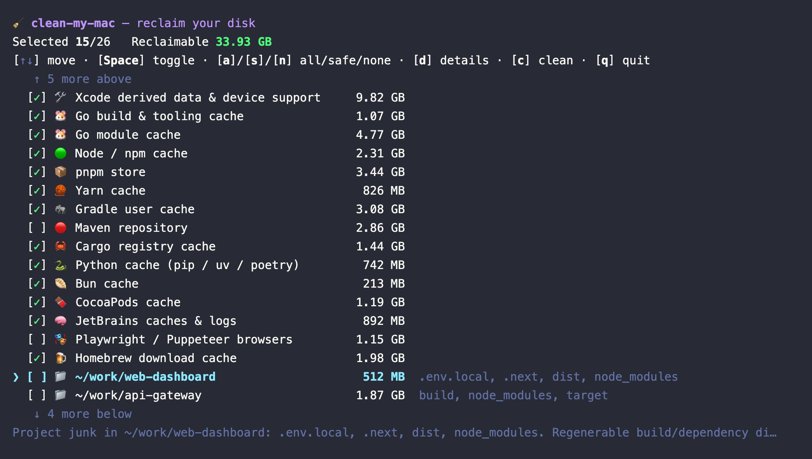

# setup-zsh

🌐 [English](README.md) | [Tiếng Việt](README_VI.md) | [简体中文](README_ZH.md) | [日本語](README_JA.md)

Bộ cấu hình Zsh nhẹ cho macOS. Thêm highlight cú pháp, tô màu danh sách file, prompt đẹp, và **gợi ý lệnh thông minh khớp bất kỳ phần nào trong lịch sử**.

Các cấu hình Zsh thông thường chỉ gợi ý lệnh *bắt đầu bằng* ký tự bạn gõ. Bộ cấu hình này tìm kiếm *toàn bộ* lịch sử và hiển thị kết quả kèm mũi tên `»`.

## Cài đặt (Một lệnh duy nhất)

Mở Terminal trên bất kỳ máy Mac nào và chạy:

```bash
curl -sSL https://raw.githubusercontent.com/openhoangnc/setup-zsh/main/setup.sh | bash
```

> Script chỉ dùng công cụ có sẵn (`curl`, `unzip`, `zsh`). Không cần cài Git hay Xcode Command Line Tools.

Sau đó áp dụng thay đổi cho terminal hiện tại:

```bash
source ~/.zshrc
```

---

## Bạn sẽ có gì

- **Gợi ý lệnh thông minh** — Các lệnh bắt đầu bằng ký tự bạn đang gõ sẽ được gợi ý trước; nếu không có lệnh nào bắt đầu như vậy, toàn bộ lịch sử sẽ được tìm kiếm để khớp ở *bất kỳ vị trí nào* trong câu lệnh, hiển thị kèm mũi tên `»`. Không phân biệt hoa/thường (gõ `GOOGLE` sẽ tìm thấy `curl -I google.com`).
- **Duyệt lịch sử bằng phím mũi tên** — Gõ từ khóa rồi nhấn **Lên / Xuống** để xem lần lượt các lệnh chứa từ khóa đó.
- **Highlight cú pháp** — Lệnh hợp lệ hiện màu xanh, lệnh sai hiện màu đỏ — ngay khi bạn gõ.
- **Prompt gọn đẹp** — Hiển thị `~/đường/dẫn (branch*) ↑1 ↓2 ❯`. Trong thư mục Git, bạn thấy tên nhánh, trạng thái thay đổi và số commit vượt trước/chậm hơn remote. Mũi tên chuyển hồng nếu lệnh trước bị lỗi.
- **Tự động chuyển thư mục** — Gõ đường dẫn thư mục rồi Enter. Không cần gõ `cd`.
- **Màu sắc file nổi bật** — File và thư mục có màu riêng, đẹp trên cả giao diện sáng lẫn tối.
- **Cấu hình mặc định tốt hơn** — Tab completion không phân biệt hoa/thường, lịch sử thông minh hơn (không trùng lặp), lưu tới 100.000 lệnh, và các phím thường dùng hoạt động đúng ý (Home / End / Fn+Delete / Option+Mũi tên để nhảy theo từng từ).
- **Cài đặt công cụ lập trình (`install-dev-tool`)** — Menu tương tác để cài Bun, Go, Homebrew, Node.js, Python & uv, Rust, JDK (Eclipse Temurin LTS), Codex, Git, OrbStack, Android Studio, VSCode, DBeaver, MongoDB Compass, Antigravity, Claude, Google Chrome, và OmniDiskSweeper. Chọn bằng phím mũi tên.
- **Dọn dẹp Mac (`clean-my-mac`)** — Công cụ tương tác giúp thu hồi dung lượng đĩa từ các cache lập trình và sản phẩm build có thể tạo lại (Xcode, Go, Node/npm/pnpm/yarn, Gradle, Maven, Cargo, Python, Homebrew, Playwright, và nhiều hơn nữa), xóa cache của Electron/trình duyệt/ứng dụng, tùy chọn quét dọn rác dự án trong các repo mã nguồn của bạn (`node_modules`, `dist`, các tệp bị git bỏ qua) với `-p`, thu hồi dung lượng Docker/Podman, và phát hiện dữ liệu còn sót lại từ các ứng dụng bạn đã gỡ cài đặt. Các danh mục được định nghĩa trong các tệp JSON có thể chỉnh sửa; nó hiển thị *cái gì* và *tại sao* cho từng mục, không bao giờ xóa khi chưa được xác nhận, và thậm chí chạy độc lập qua `curl … | bash`.

---

## Cách sử dụng

### 1. Gợi ý lệnh thông minh

Khi bạn gõ, Zsh tự động hiện gợi ý mờ từ lịch sử lệnh. Gợi ý **bắt đầu bằng** ký tự bạn gõ được ưu tiên; khi không có lệnh nào bắt đầu như vậy, lệnh gần nhất **chứa** ký tự đó sẽ hiển thị sau mũi tên `»`.

- **Khớp đầu câu**: Gõ `curl` → thấy ` -I google.com` màu xám. Nhấn `→` hoặc `Ctrl+F` để chấp nhận.
- **Khớp ở giữa**: Gõ `google` → thấy `» curl -I google.com`.
  - Nhấn **`→`** hoặc **`Ctrl+F`** để chấp nhận toàn bộ.
  - Nhấn **`Option+→`** (hoặc `Alt+F`) để chấp nhận từng từ.
- **Xem thêm kết quả**: Nhấn **Mũi tên Lên** để thay bằng kết quả khác, tiếp tục nhấn **Lên / Xuống** để duyệt hết.

> ⚠️ **Enter luôn chạy đúng những gì bạn đã gõ** — không bao giờ chạy gợi ý mờ. Để chạy gợi ý `»`, hãy chấp nhận nó trước bằng `→` (hoặc `Ctrl+F`), rồi nhấn Enter.

### 2. Tự động chuyển thư mục

Gõ đường dẫn rồi nhấn Enter:
```bash
~/Downloads  # chuyển đến ~/Downloads
..           # lùi lại một cấp
```

> Nếu tên thư mục trùng với tên một lệnh (ví dụ `test`), lệnh sẽ được ưu tiên chạy. Thêm dấu gạch chéo phía sau để buộc chuyển thư mục: `test/`.

### 3. Prompt hiển thị Git

- Hiển thị `~/đường/dẫn (branch*) ↑1 ↓2 ❯ `. Đường dẫn dài sẽ được tự động rút gọn.
- Dấu `*` hồng = có thay đổi chưa stage. Dấu `+` xanh = có thay đổi đã stage.
- `↑N` xanh = vượt trước remote N commit (cần push). `↓N` hồng = chậm hơn N commit (cần pull). Ẩn khi đã đồng bộ.
- Mũi tên `❯` chuyển hồng nếu lệnh cuối bị lỗi.

### 4. Cài đặt công cụ lập trình (`install-dev-tool`)

Chạy `install-dev-tool` để mở menu tương tác.


- **Di chuyển**: Dùng phím **Lên / Xuống / Trái / Phải** để di chuyển con trỏ (`❯`).
- **Chọn công cụ**: Nhấn **Space** hoặc **Enter** để đánh dấu chọn (`[ ]` ↔ `[✓]`), hoặc gõ số thứ tự của công cụ (với các mục 10–17, gõ nhanh cả hai chữ số).
- **Thao tác (gộp trên 1 dòng ở dưới)**:
  - **Cài đặt**: Chuyển đến `[I] Install` rồi nhấn **Enter** (hoặc gõ `I`).
  - **Chọn tất cả**: Chuyển đến `[A] Toggle All` rồi nhấn **Enter** (hoặc gõ `A`).
  - **Cập nhật tất cả bản cũ**: Chuyển đến `[U] Select Outdated` rồi nhấn **Enter** (hoặc gõ `U`), hoặc chạy `install-dev-tool --update-all` trực tiếp từ terminal (lệnh sẽ tự thoát khi hoàn tất).
  - **Thoát**: Chuyển đến `[E] Exit` rồi nhấn **Enter** (hoặc gõ `E`, `Q`, `Esc`, hoặc `Ctrl+C`).
- **Tùy chọn CLI**: `install-dev-tool --help` liệt kê tất cả tùy chọn (`-u/--update-all`, `-a/--all`).

**Lưu ý thêm:**
- Bun được cài qua script chính thức (`https://bun.sh/install`) vào `~/.bun/bin`.
- Go và Node.js cài vào `~/.local/` — không cần `sudo`, kể cả khi cài npm package toàn cục.
- Homebrew được cài qua script chính thức (`https://raw.githubusercontent.com/Homebrew/install/HEAD/install.sh`) và tự động cấu hình `shellenv`.
- Python được cài kèm `uv` (trình quản lý package & project Python tốc độ cao của Astral).
- JDK cài đặt bản chính thức Eclipse Temurin LTS và tự cấu hình `JAVA_HOME`.
- Ứng dụng desktop (VSCode, Claude, OrbStack, MongoDB Compass, DBeaver, Google Chrome, Android Studio, Antigravity, OmniDiskSweeper) tự động tải về và đặt vào `/Applications`.
- Git được cài qua công cụ chính thức của Apple (`xcode-select --install`).
- Trình cài đặt tự kiểm tra phiên bản mới nhất khi khởi động.

### 5. Dọn dẹp Mac (`clean-my-mac`)

Chạy `clean-my-mac` để mở menu dọn dẹp tương tác. Công cụ sẽ quét máy Mac của bạn và nhóm mọi thứ có thể thu hồi an toàn thành các danh mục, mỗi danh mục hiển thị dung lượng sẽ được giải phóng.



Nó cũng **chạy độc lập** — không cần cài đặt setup-zsh trước:

```bash
curl -sSL https://raw.githubusercontent.com/openhoangnc/setup-zsh/main/bin/clean-my-mac | bash
# dry-run (chỉ xem, không xóa gì):
curl -sSL https://raw.githubusercontent.com/openhoangnc/setup-zsh/main/bin/clean-my-mac | bash -s -- --dry-run
```

- **Điều hướng**: Dùng phím **Lên / Xuống** (hoặc `j` / `k`) để di chuyển con trỏ (`❯`). Các danh mục được sắp xếp từ lớn đến nhỏ, nên những mục giải phóng nhiều nhất nằm ở trên cùng.
- **Chọn**: Nhấn **Space** để đánh dấu/bỏ đánh dấu một danh mục (`[ ]` ↔ `[✓]`). Các cache an toàn, có thể tạo lại được chọn sẵn; các mục rủi ro hơn (kho Maven, Playwright, nhật ký sự cố), các thư mục dự án, và dữ liệu ứng dụng mồ côi bắt đầu ở trạng thái **chưa chọn**.
- **Chi tiết**: Nhấn **Enter** (hoặc **`d`**) để xem chính xác đường dẫn và dung lượng bên trong danh mục đang được chọn; nhấn phím bất kỳ để quay lại.
- **Hàng loạt**: **`a`** chọn tất cả, **`n`** bỏ chọn tất cả, **`s`** đặt lại về mặc định an toàn.
- **Dọn dẹp**: Nhấn **`c`** để xem lại kế hoạch chi tiết (những gì sẽ bị **xóa** so với **chuyển vào Thùng rác**, kèm tổng dung lượng), rồi xác nhận bằng `y`.
- **Thoát**: Nhấn **`q`** (hoặc `Esc`).

**Những gì công cụ xóa:**
- **Cache lập trình & sản phẩm build** — Xcode DerivedData/DeviceSupport, cache build & module của Go, cache npm/pnpm/yarn, Gradle, Maven, Cargo, Python (pip/uv/poetry), Bun, CocoaPods, JetBrains, Playwright, và cache tải về của Homebrew.
- **Cache của Electron, trình duyệt & ứng dụng** — cache trên đĩa/GPU/code của các ứng dụng Electron (VS Code, Claude, Slack, …) và trình duyệt (Chrome, Brave, Edge, Vivaldi, Arc, Firefox).
- **Rác dự án (`-p`)** — với `clean-my-mac -p`, công cụ cũng quét các repo mã nguồn của bạn để tìm các thư mục có thể tạo lại (`node_modules`, `dist`, `build`, `target`, `__pycache__`, …) và, tùy chọn, mọi thứ mà `.gitignore` của bạn bỏ qua.
- **Docker / Podman** — thu hồi các container đã dừng, các image không dùng đến, và cache build qua `system prune -af` (tùy chọn tham gia). Các named volume / cơ sở dữ liệu không bao giờ bị đụng đến.
- **Dữ liệu ứng dụng mồ côi** — các thư mục `Application Support` / `Caches` / `Preferences` còn sót lại mà ứng dụng sở hữu chúng không còn được cài đặt.

**Patterns có thể chỉnh sửa.** Mỗi danh mục được mô tả bởi các tệp "pattern" JSON (trong thư mục [`clean-my-mac-rules/`](clean-my-mac-rules/), được cài đặt vào `~/.zsh/setup-zsh/clean-my-mac-rules`, hoặc được tải về khi chạy độc lập). Chỉnh sửa chúng để thêm hoặc bớt mục tiêu — không cần thay đổi mã. Trỏ đến bộ của riêng bạn với `clean-my-mac --patterns <dir-or-url>`.

**Lưu ý thêm:**
- Cache và sản phẩm build bị xóa vĩnh viễn (đó là mục đích). **Dữ liệu ứng dụng mồ côi và các tệp bị git bỏ qua được chuyển vào Thùng rác**, nên bạn có thể khôi phục chúng.
- Sandbox của ứng dụng và mọi thứ thuộc sở hữu của Apple/hệ thống sẽ không bao giờ bị đụng đến, và các thư mục có giá trị cao (`~/Documents`, `~/Desktop`, `~/Downloads`, `~/Pictures`, `~/.ssh`, iCloud Drive, …) sẽ không bao giờ bị xóa bất kể một pattern nói gì. Danh sách ứng dụng đã cài được đọc từ LaunchServices, nên các prefPane, plugin, và driver vẫn đang được cài sẽ không bị nhầm là mồ côi.
- Quét dự án **tắt theo mặc định** (`-p` để bật) vì quét thư mục nhà của bạn chậm hơn.
- `clean-my-mac --dry-run` hiển thị những gì có thể được giải phóng mà không xóa bất cứ thứ gì. `clean-my-mac --yes` xóa các cache an toàn được chọn sẵn theo cách không tương tác (bỏ qua các thư mục dự án, dữ liệu mồ côi, và Thùng rác). `clean-my-mac --help` liệt kê tất cả tùy chọn.
- Mỗi lần chạy đều được ghi nhật ký vào `~/.zsh/setup-zsh/clean.log`.

---

## Gỡ cài đặt (Một lệnh duy nhất)

Muốn xóa hết và trở về cài đặt gốc:

```bash
curl -sSL https://raw.githubusercontent.com/openhoangnc/setup-zsh/main/uninstall.sh | bash
```

Lệnh này sẽ:
1. **Xóa phần cấu hình setup-zsh** khỏi `~/.zshrc` — các alias và cấu hình riêng của bạn được giữ nguyên. Nếu file do script tạo ra và giờ trống, nó sẽ bị xóa luôn.
2. **Xóa thư mục plugin** tại `~/.zsh/setup-zsh/` — không ảnh hưởng gì đến các thư mục khác trong `~/.zsh/`.

---

## Bản quyền

Phân phối theo [MIT License](LICENSE).

Bao gồm các plugin bên thứ ba trong thư mục `plugins/`:
- **zsh-syntax-highlighting** — [BSD 3-Clause License](plugins/zsh-syntax-highlighting/COPYING.md)
- **zsh-autosuggestions** — [MIT License](plugins/zsh-autosuggestions/LICENSE)
