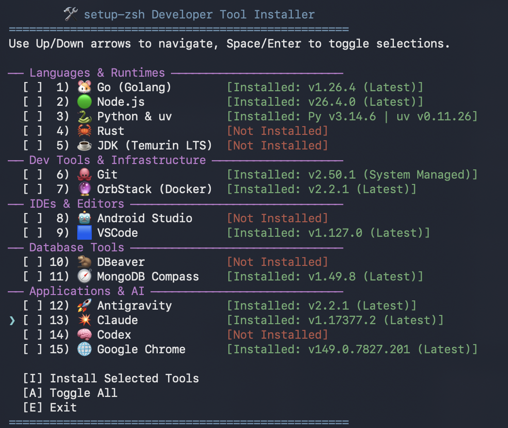

# setup-zsh

🌐 [English](README.md) | [Tiếng Việt](README_VI.md) | [简体中文](README_ZH.md) | [日本語](README_JA.md)

Bộ cấu hình Zsh nhẹ cho macOS. Thêm highlight cú pháp, tô màu danh sách file, prompt đẹp, và **gợi ý lệnh thông minh khớp bất kỳ phần nào trong lịch sử**.

Các cấu hình Zsh thông thường chỉ gợi ý lệnh *bắt đầu bằng* ký tự bạn gõ. Bộ cấu hình này tìm kiếm *toàn bộ* lịch sử và hiển thị kết quả kèm mũi tên `»`.

## Cài đặt (Một lệnh duy nhất)

Mở Terminal trên bất kỳ máy Mac nào và chạy:

```bash
curl -sSL https://raw.githubusercontent.com/openhoangnc/setup-zsh/main/setup.sh | bash
```

> Script chỉ dùng công cụ có sẵn (`curl`, `unzip`, `zsh`). Không cần cài Git hay Xcode Command Line Tools.

Sau đó áp dụng thay đổi cho terminal hiện tại:

```bash
source ~/.zshrc
```

---

## Bạn sẽ có gì

- **Gợi ý lệnh thông minh** — Gõ bất kỳ từ nào, hệ thống sẽ tìm trong lịch sử dù từ đó nằm ở giữa câu lệnh. Không phân biệt hoa/thường (gõ `GOOGLE` sẽ tìm thấy `curl -I google.com`).
- **Duyệt lịch sử bằng phím mũi tên** — Gõ từ khóa rồi nhấn **Lên / Xuống** để xem lần lượt các lệnh chứa từ khóa đó.
- **Highlight cú pháp** — Lệnh hợp lệ hiện màu xanh, lệnh sai hiện màu đỏ — ngay khi bạn gõ.
- **Prompt gọn đẹp** — Hiển thị `~/đường/dẫn (branch*) ❯`. Trong thư mục Git, bạn thấy tên nhánh và trạng thái thay đổi. Mũi tên chuyển hồng nếu lệnh trước bị lỗi.
- **Tự động chuyển thư mục** — Gõ đường dẫn thư mục rồi Enter. Không cần gõ `cd`.
- **Màu sắc file nổi bật** — File và thư mục có màu riêng, đẹp trên cả giao diện sáng lẫn tối.
- **Cấu hình mặc định tốt hơn** — Tab completion, lịch sử không trùng lặp, lưu tới 100.000 lệnh.
- **Cài đặt công cụ lập trình (`install-dev-tool`)** — Menu tương tác để cài Bun, Go, Node.js, Python & uv, Rust, JDK (Eclipse Temurin LTS), Codex, Git, OrbStack, Android Studio, VSCode, DBeaver, MongoDB Compass, Antigravity, Claude, và Google Chrome. Chọn bằng phím mũi tên.

---

## Cách sử dụng

### 1. Gợi ý lệnh thông minh

Khi bạn gõ, Zsh tự động hiện gợi ý mờ từ lịch sử lệnh.

- **Khớp đầu câu**: Gõ `curl` → thấy ` -I google.com` màu xám. Nhấn `→` hoặc `Ctrl+F` để chấp nhận.
- **Khớp ở giữa**: Gõ `google` → thấy `» curl -I google.com`.
  - Nhấn **`→`** hoặc **`Ctrl+F`** để chấp nhận toàn bộ.
  - Nhấn **`Option+→`** (hoặc `Alt+F`) để chấp nhận từng từ.
- **Xem thêm kết quả**: Nhấn **Mũi tên Lên** để thay bằng kết quả khác, tiếp tục nhấn **Lên / Xuống** để duyệt hết.

### 2. Tự động chuyển thư mục

Gõ đường dẫn rồi nhấn Enter:
```bash
~/Downloads  # chuyển đến ~/Downloads
..           # lùi lại một cấp
```

### 3. Prompt hiển thị Git

- Hiển thị `~/đường/dẫn (branch*) ❯ `. Đường dẫn dài sẽ được tự động rút gọn.
- Dấu `*` hồng = có thay đổi chưa stage. Dấu `+` xanh = có thay đổi đã stage.
- Mũi tên `❯` chuyển hồng nếu lệnh cuối bị lỗi.

### 4. Cài đặt công cụ lập trình (`install-dev-tool`)

Chạy `install-dev-tool` để mở menu tương tác.



- **Di chuyển**: Dùng phím **Lên / Xuống / Trái / Phải** để di chuyển con trỏ (`❯`).
- **Chọn công cụ**: Nhấn **Space** hoặc **Enter** để đánh dấu chọn (`[ ]` ↔ `[✓]`).
- **Thao tác (gộp trên 1 dòng ở dưới)**:
  - **Cài đặt**: Chuyển đến `[I] Install` rồi nhấn **Enter** (hoặc gõ `I`).
  - **Chọn tất cả**: Chuyển đến `[A] Toggle All` rồi nhấn **Enter** (hoặc gõ `A`).
  - **Cập nhật tất cả bản cũ**: Chuyển đến `[U] Select Outdated` rồi nhấn **Enter** (hoặc gõ `U`), hoặc chạy `install-dev-tool --update-all` trực tiếp từ terminal.
  - **Thoát**: Chuyển đến `[E] Exit` rồi nhấn **Enter** (hoặc gõ `E`).

**Lưu ý thêm:**
- Bun được cài qua script chính thức (`https://bun.sh/install`) vào `~/.bun/bin`.
- Go và Node.js cài vào `~/.local/` — không cần `sudo`, kể cả khi cài npm package toàn cục.
- Python được cài kèm `uv` (trình quản lý package & project Python tốc độ cao của Astral).
- JDK cài đặt bản chính thức Eclipse Temurin LTS và tự cấu hình `JAVA_HOME`.
- Ứng dụng desktop (VSCode, Claude, OrbStack, MongoDB Compass, DBeaver, Google Chrome, Android Studio, Antigravity) tự động tải về và đặt vào `/Applications`.
- Git được cài qua công cụ chính thức của Apple (`xcode-select --install`).
- Trình cài đặt tự kiểm tra phiên bản mới nhất khi khởi động.

---

## Gỡ cài đặt (Một lệnh duy nhất)

Muốn xóa hết và trở về cài đặt gốc:

```bash
curl -sSL https://raw.githubusercontent.com/openhoangnc/setup-zsh/main/uninstall.sh | bash
```

Lệnh này sẽ:
1. **Xóa phần cấu hình setup-zsh** khỏi `~/.zshrc` — các alias và cấu hình riêng của bạn được giữ nguyên. Nếu file do script tạo ra và giờ trống, nó sẽ bị xóa luôn.
2. **Xóa thư mục plugin** tại `~/.zsh/setup-zsh/` — không ảnh hưởng gì đến các thư mục khác trong `~/.zsh/`.

---

## Bản quyền

Phân phối theo [MIT License](LICENSE).

Bao gồm các plugin bên thứ ba trong thư mục `plugins/`:
- **zsh-syntax-highlighting** — [BSD 3-Clause License](plugins/zsh-syntax-highlighting/COPYING.md)
- **zsh-autosuggestions** — [MIT License](plugins/zsh-autosuggestions/LICENSE)
